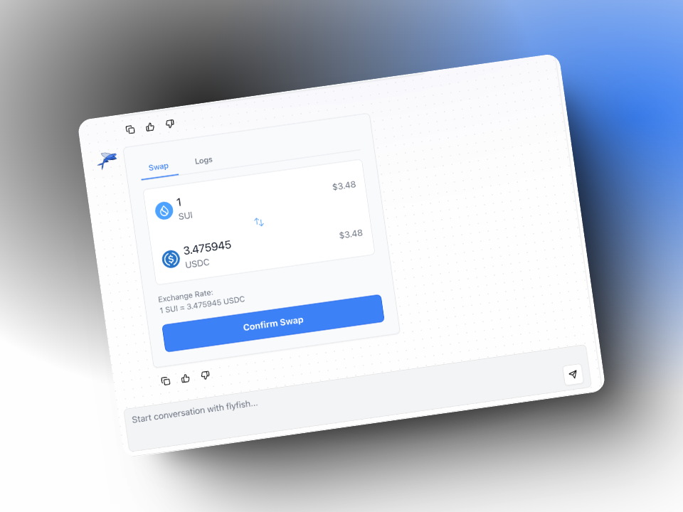

# FlyFish 🐟

**FlyFish** is your ultimate AI assistant, seamlessly powered by **ElizaOS** and **Atoma**, two cutting-edge AI systems designed for Web3 interactions. Whether you're navigating Generative AI, swapping and transferring tokens, or executing advanced decentralized actions, FlyFish unlocks endless possibilities—especially within the **Sui** Blockchain ecosystem. Dive into the future of AI-driven Web3 automation with FlyFish!

  

#### Launch Demo🌈: [FlyFish Chat Demo]()

## Table of Contents

- [FlyFish Chat 🐟](#flyfish-chat-) - [Launch Demo🌈: FlyFish Chat Demo](#launch-demo-flyfish-chat-demo)
- [Table of Contents](#table-of-contents)
- [Overview](#overview)
- [Features](#features)
- [Architecture](#architecture)
- [Track](#track)
- [License](#license)

## Overview

FlyFish redefines **`Web3`** interactions by merging **`AI intelligence`** with **`blockchain automation`**. Powered by **`ElizaOS`** and **`Atoma`**, it transforms complex blockchain tasks into simple, intuitive conversations.

### 🌟 AI-Driven Web3 Automation
- 🗣 Natural Language Interaction – Chat to handle **`transactions`**, **`manage assets`**, and interact with **`smart contracts`**, all with a **`dynamic UI`** that gives you full control over execution.
- 📈 Intelligent Blockchain Insights – Gain real-time, **`AI-driven analytics`** on your portfolio and market trends, tailored to your **`personalized data`** seamlessly aggregated through **`Tusky (Walrus)`**.

### 🔄 Action-Based UI for Web3 Transactions
- 🛠 Dynamic Interfaces – FlyFish dynamically generates **`interactive interfaces`** based on the **`AI Agent's`** responses, ensuring a seamless and intuitive **`Web3`** experience.

🔥 Step into the future of **`AI-powered decentralization`**!

## Features

- **🤖 Interaction with Large Language Models (in Web3 Context)**: Leverages advanced AI models from **`Atoma`** (Model Provider) to understand and execute complex **`Web3`** operations through natural language conversations. The system interprets user intent and seamlessly converts it into **`blockchain actions`**.

- **📊 Crawl Result Viewing**: Access and analyze personalized Web3 data collected through the **`FlyFish extension`**. View filtered content from various websites stored securely in **`Tusky (Walrus)`**, enabling data-driven decision making for your Web3 activities and will be the huge knowledge base for **`AI Agent`**.

- **⚡ On-Chain Query Execution**: Execute real-time **`blockchain queries`** through simple commands. Check **`token balances`**, view **`transaction history`**, monitor **`smart contract`** states, and access on-chain data effortlessly using natural language instructions.

- **🏦 SuiLend Integration**: Seamlessly interact with **`SuiLend's`** lending and borrowing protocols through natural language commands. Monitor your positions, supply assets, borrow against collateral, and manage your **`DeFi portfolio`** with AI-guided assistance.

- **💫 User-friendly Interface**: Experience Web3 through an intuitive **`chat interface`** that transforms complex blockchain operations into simple conversations. The **`dynamic UI`** adapts to your needs, providing clear action buttons and transaction previews before execution.

## Overview Architecture

- **Frontend Cointainer** will constis of 2 components:
  - **Extension Components**: An extension help crawler data from any website and help filter content of website based on user's need then store in decentralized storage **`Tusky (Walrus)`**. You can find the extension components in this repository: [Extension Components](https://github.com/Weminal-labs/flyfish-extension)
  - **Web Client Components**: A chat interface that allows users to interact with **`FlyFish agent`** and get **`personalized collected data`** from **`Tusky (Walrus)`** from extension components above. You can find the web client components in this repository: [Web Client Components](https://github.com/Weminal-labs/flyfish-chat)
- **Agent Container**: A container that contains the agent components. We have implement some **`actions`** in support interacting with **`SUI blockchain`** and other **`DEFI protocols`** on **`Sui Blockchain`**.
This is the repository for Agent Container:
[Agent Container](https://github.com/tung-lee/flyfish-agent)
This is the repository for building `sui plugin`: 
[Sui Plugin](https://github.com/tung-lee/eliza/tree/main/packages/plugin-sui)
We have publish our plugin in npmjs:
[Sui Plugin NPM](https://www.npmjs.com/package/elizaos-plugin-sui)

For a detailed breakdown of each component, please refer to the architecture documentation in their respective repositories.

## Track
We apply the following technologies:
- Atoma: Serves as our model provider, powering AI-driven capabilities.
- ElizaOS: Used for building intelligent agents and developing the Sui plugin.
- Sui: Leveraging Walrus for data storage, Sui Wallet Connect for seamless interactions, and more.
- SuiLend: Integrated suilend SDK to equip ElizaOS agents with advanced tools.

## License

This project is licensed under the MIT License - see the LICENSE file for details.
