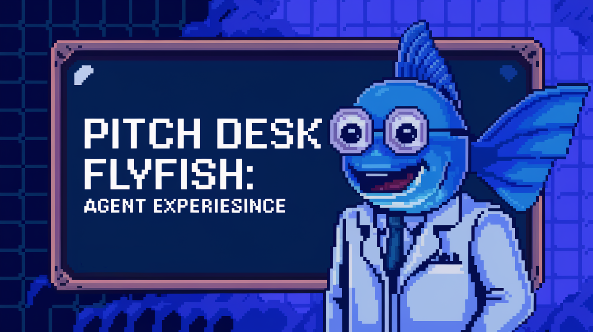
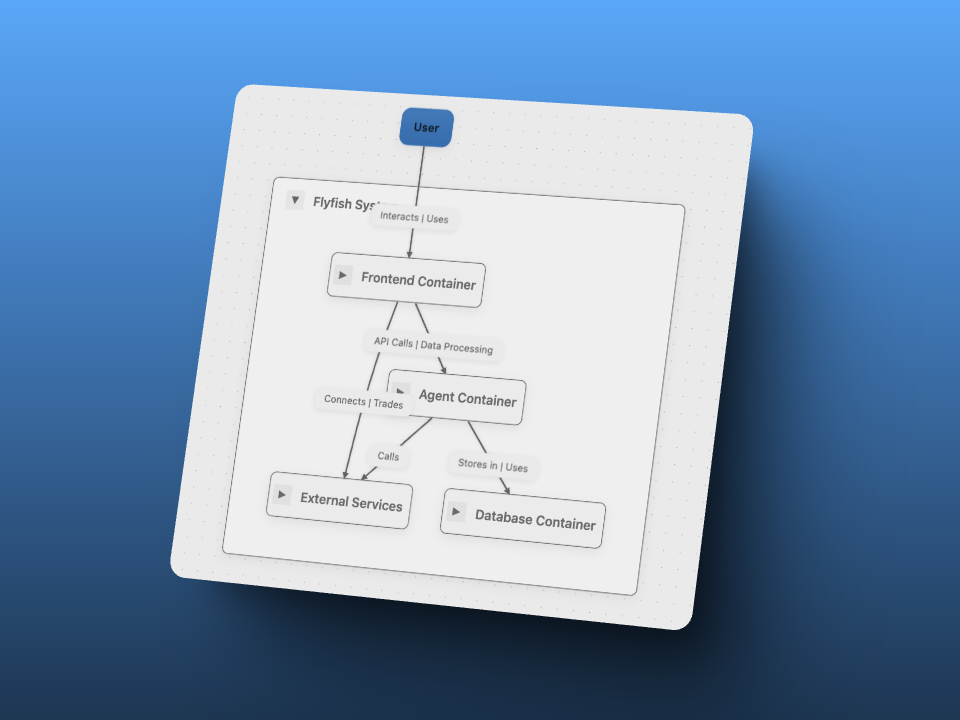

# FlyFish 🐟

FlyFish is your personal AI assistant, seamlessly integrating **ElizaOS Agent** and **Atoma** in the background. These AI systems are fine-tuned to execute a wide range of Web3 actions, from interacting with cutting-edge Generative AI to swapping, transferring tokens, and beyond—unlocking limitless possibilities in the decentralized world.

  

#### Launch Demo🌈: [FlyFish Chat Demo]()

## Table of Contents

- [FlyFish Chat 🐟](#flyfish-chat-) - [Launch Demo🌈: FlyFish Chat Demo](#launch-demo-flyfish-chat-demo)
- [Table of Contents](#table-of-contents)
- [Overview](#overview)
- [Features](#features)
- [Architecture](#architecture)
- [Track](#track)
- [License](#license)

## Overview

FLYFISH: AI-POWERED WEB3 ASSISTANT 🚀

FlyFish is a cutting-edge AI-driven Web3 assistant that seamlessly integrates ElizaOS Agent and Atoma, bridging AI with blockchain technology. It provides an intuitive interface that empowers users to:

💬 Execute Web3 Actions with Natural Language – Perform transactions, interact with smart contracts, and manage assets effortlessly.

🧠 Harness AI Optimized for Blockchain – Access advanced AI capabilities designed to enhance Web3 experiences.

🔄 Swap & Transfer Tokens Cross-Chain – Seamlessly move assets like SUI, USDC, and USDT with AI-guided assistance.

📊 Analyze On-Chain Data with AI Insights – Gain deep blockchain analytics and actionable insights in real time.

🌐 Engage with dApps Using Conversational Commands – Navigate decentralized applications with a simple chat-based interface.

Built on Sui Blockchain and integrated with SuiLend, FlyFish simplifies complex Web3 interactions, making them as easy as a conversation. Whether you're a DeFi enthusiast, trader, or developer, FlyFish is your intelligent companion in the decentralized world. 🚀

## Features

- **Interaction with Large Generative AI System (in Web3 Context)**: add description here.
- **Crawl Result Viewing**: add description here.
- **Using Customized ElizaOS Agent's Actions**: add description here.
- **Cross-token Swaps**: add description here.
- **User-friendly Interface**: add description here.

## Architecture

For a detailed breakdown of each component, please refer to the architecture documentation in their respective repositories.

## Track
We apply the following technologies:
- Atoma: Serves as our model provider, powering AI-driven capabilities.
- ElizaOS: Used for building intelligent agents and developing the Sui plugin.
- Sui: Leveraging Walrus for data storage, Sui Wallet Connect for seamless interactions, and more.
- SuiLend: Integrated suilend SDK to equip ElizaOS agents with advanced tools.

## License

This project is licensed under the MIT License - see the LICENSE file for details.
